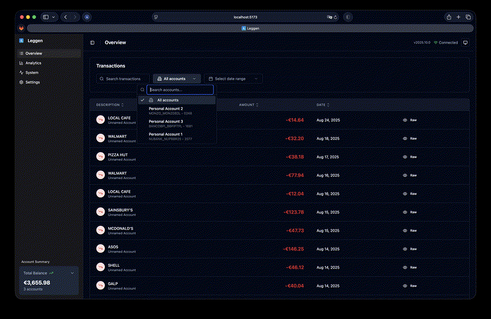

# 💲 leggen


A self hosted Open Banking Dashboard, API and CLI for managing bank connections and transactions.

Having your bank data accessible through both CLI and REST API gives you the power to backup, analyze, create reports, and integrate with other applications.



## 🛠️ Technologies

  ### Frontend
  - [React](https://reactjs.org/): Modern web interface with TypeScript
  - [Vite](https://vitejs.dev/): Fast build tool and development server
  - [Tailwind CSS](https://tailwindcss.com/): Utility-first CSS framework
  - [shadcn/ui](https://ui.shadcn.com/): Modern component system built on Radix UI
  - [TanStack Query](https://tanstack.com/query): Powerful data synchronization for React

  ### 🔌 API & Backend
  - [FastAPI](https://fastapi.tiangolo.com/): High-performance async API backend (integrated into `leggen server`)
  - [GoCardless Open Banking API](https://developer.gocardless.com/bank-account-data/overview): for connecting to banks
  - [APScheduler](https://apscheduler.readthedocs.io/): Background job scheduling with configurable cron

  ### 📦 Storage
  - [SQLite](https://www.sqlite.org): for storing transactions, simple and easy to use


## ✨ Features

### 🎯 Core Banking Features
- Connect to banks using GoCardless Open Banking API (30+ EU countries)
- List all connected banks and their connection statuses
- View balances of all connected accounts
- List and filter transactions across all accounts
- Support for both booked and pending transactions

### 🔄 Data Management
- Sync all transactions with SQLite database
- Background sync scheduling with configurable cron expressions
- Automatic transaction deduplication and status tracking
- Real-time sync status monitoring

### 📡 API & Integration
- **REST API**: Complete FastAPI backend with comprehensive endpoints
- **CLI Interface**: Enhanced command-line tools with new options

### 🔔 Notifications & Monitoring
- Discord and Telegram notifications for filtered transactions
- Configurable transaction filters (case-sensitive/insensitive)
- Account expiry notifications and status alerts
- Comprehensive logging and error handling

## 🚀 Quick Start

### Prerequisites
1. Create a GoCardless account at [https://gocardless.com/bank-account-data/](https://gocardless.com/bank-account-data/)
2. Get your API credentials (key and secret)

### Installation

#### Docker Compose (Recommended)

```bash
# Clone the repository
git clone https://github.com/elisiariocouto/leggen.git
cd leggen

# Create your configuration
mkdir -p data && cp config.example.toml data/config.toml
# Edit data/config.toml with your GoCardless credentials

# Start all services
docker compose up -d

# Access the web interface at http://localhost:3000
# API documentation at http://localhost:3000/api/v1/docs
```

### Configuration

Create a configuration file at `./data/config.toml` (for Docker) or `~/.config/leggen/config.toml` (for local development):

```toml
[gocardless]
key = "your-api-key"
secret = "your-secret-key"
url = "https://bankaccountdata.gocardless.com/api/v2"

[database]
sqlite = true

# Optional: Background sync scheduling
[scheduler.sync]
enabled = true
hour = 3      # 3 AM
minute = 0
# cron = "0 3 * * *"  # Alternative: use cron expression

# Optional: Discord notifications
[notifications.discord]
webhook = "https://discord.com/api/webhooks/..."
enabled = true

# Optional: Telegram notifications
[notifications.telegram]
token = "your-bot-token"
chat_id = 12345
enabled = true

# Optional: Transaction filters for notifications
[filters]
case_insensitive = ["salary", "utility"]
case_sensitive = ["SpecificStore"]
```

## 📖 Usage

### Web Interface
Access the React web interface at `http://localhost:3000` after starting the services.

### API Service
Visit `http://localhost:3000/api/v1/docs` for interactive API documentation.

### CLI Commands
```bash
leggen status              # Check connection status
leggen bank add            # Connect to a new bank
leggen balances            # View account balances
leggen transactions        # List transactions
leggen sync                # Trigger background sync
```

For more options, run `leggen --help` or `leggen <command> --help`.

## ⚠️ Notes
- This project is in active development
