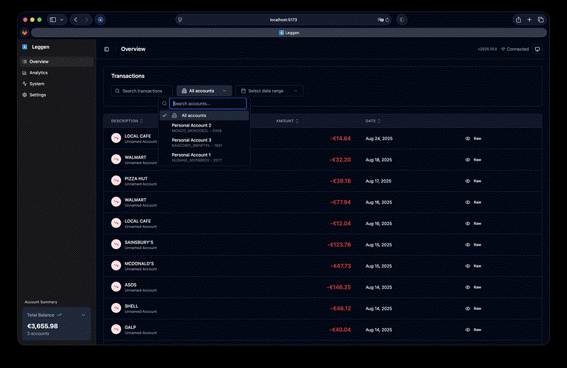
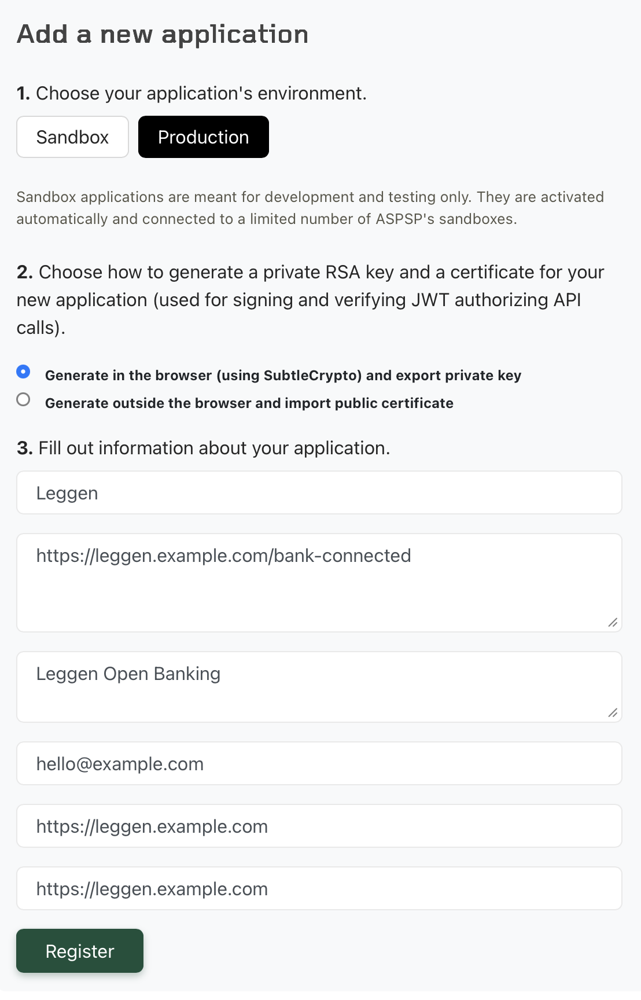

# 💲 leggen


A self hosted Open Banking Dashboard, API and CLI for managing bank connections and transactions.

Having your bank data accessible through both CLI and REST API gives you the power to backup, analyze, create reports, and integrate with other applications.



## 🛠️ Technologies

  ### Frontend
  - [React](https://reactjs.org/): Modern web interface with TypeScript
  - [Vite](https://vitejs.dev/): Fast build tool and development server
  - [Tailwind CSS](https://tailwindcss.com/): Utility-first CSS framework
  - [shadcn/ui](https://ui.shadcn.com/): Modern component system built on Radix UI
  - [TanStack Query](https://tanstack.com/query): Powerful data synchronization for React

  ### 🔌 API & Backend
  - [FastAPI](https://fastapi.tiangolo.com/): High-performance async API backend (integrated into `leggen server`)
  - [EnableBanking](https://enablebanking.com/): Open Banking data access for connecting to banks
  - [APScheduler](https://apscheduler.readthedocs.io/): Background job scheduling with configurable cron

  ### 📦 Storage
  - [SQLite](https://www.sqlite.org): for storing transactions, simple and easy to use


## ✨ Features

### 🎯 Core Banking Features
- Connect to banks using EnableBanking (30+ EU countries)
- List all connected banks and their connection statuses
- View balances of all connected accounts
- List and filter transactions across all accounts

### 🔄 Data Management
- Sync all transactions with SQLite database
- Background sync scheduling with configurable cron expressions

### 📡 API & Integration
- **REST API**: Complete FastAPI backend with comprehensive endpoints
- **CLI Interface**: Enhanced command-line tools with new options

### 🔔 Notifications & Monitoring
- Discord and Telegram notifications for filtered transactions
- Configurable transaction filters (case-sensitive/insensitive)
- Account expiry notifications and status alerts
- Comprehensive logging and error handling

## 🚀 Quick Start

### Prerequisites
1. Create an Enable Banking account at [https://enablebanking.com/](https://enablebanking.com/)
2. Create an application in the [Enable Banking Customer Portal](https://enablebanking.com/cp/applications) as the image below. The redirect URL must use HTTPS and must end with `/bank-connected`. Enable Banking does not support HTTP.
3. Set up your bank accounts following the [Enable Banking Setup Guide](docs/enable-banking-setup.md)



### Installation

#### Docker Compose

```bash
# Clone the repository
git clone https://github.com/elisiariocouto/leggen.git
cd leggen

# Create your configuration
mkdir -p data && cp config.example.toml data/config.toml
# Edit data/config.toml with your EnableBanking credentials

# Start all services
docker compose up -d
```

### Configuration

Create a configuration file at `./data/config.toml`:

```toml
[enablebanking]
application_id = "your-application-id"
key_path = "/path/to/private-key.pem"
# url = "https://api.enablebanking.com"

[database]
sqlite = true

# Optional: Background sync scheduling
[scheduler.sync]
enabled = true
hour = 3      # 3 AM
minute = 0
# cron = "0 3 * * *"  # Alternative: use cron expression

# Optional: Discord notifications
[notifications.discord]
webhook = "https://discord.com/api/webhooks/..."
enabled = true

# Optional: Telegram notifications
[notifications.telegram]
token = "your-bot-token"
chat_id = 12345
enabled = true

# Optional: Transaction filters for notifications
[filters]
case_insensitive = ["salary", "utility"]
case_sensitive = ["SpecificStore"]
```

## 📖 Usage

### Web Interface
Access the React web interface at `http://localhost:3000` after starting the services.

### API Service
Visit `http://localhost:3000/api/v1/docs` for interactive API documentation.

### CLI Commands
```bash
leggen status              # Check connection status
leggen bank add            # Connect to a new bank
leggen balances            # View account balances
leggen transactions        # List transactions
leggen sync                # Trigger accounts sync
```

For more options, run `leggen --help` or `leggen <command> --help`.

## ⚠️ Notes
- This project is in active development
