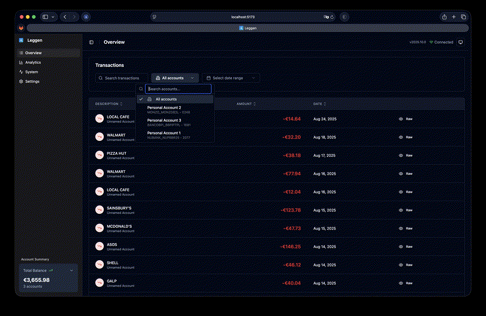
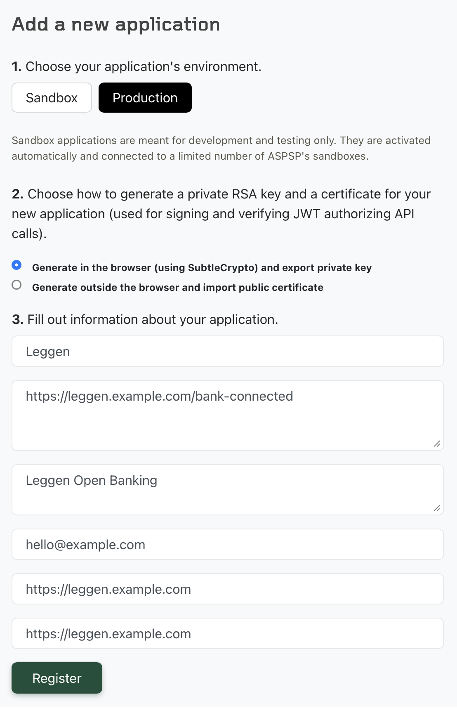

# 💲 leggen


A self hosted Open Banking Dashboard, API and CLI for managing bank connections and transactions.

Having your bank data accessible through both CLI and REST API gives you the power to backup, analyze, create reports, and integrate with other applications.



## 🛠️ Technologies

  ### Frontend
  - [React](https://reactjs.org/): Modern web interface with TypeScript
  - [Vite](https://vitejs.dev/): Fast build tool and development server
  - [Tailwind CSS](https://tailwindcss.com/): Utility-first CSS framework
  - [shadcn/ui](https://ui.shadcn.com/): Modern component system built on Radix UI
  - [TanStack Query](https://tanstack.com/query): Powerful data synchronization for React

  ### 🔌 API & Backend
  - [FastAPI](https://fastapi.tiangolo.com/): High-performance async API backend (integrated into `leggen server`)
  - [EnableBanking](https://enablebanking.com/): Open Banking data access for connecting to banks
  - [APScheduler](https://apscheduler.readthedocs.io/): Background job scheduling with configurable cron

  ### 📦 Storage
  - [SQLite](https://www.sqlite.org): for storing transactions, simple and easy to use


## ✨ Features

### 🎯 Core Banking Features
- Connect to banks using EnableBanking (30+ EU countries)
- List all connected banks and their connection statuses
- View balances of all connected accounts
- List and filter transactions across all accounts

### 🏷️ Categorization & Analytics
- Categorize transactions with custom categories
- Keyword-based learning: automatically categorizes future transactions matching the same description
- Bulk categorization and removal by transaction description
- Filter transactions by category (including uncategorized)
- Analytics dashboard with spending-by-category breakdown
- `exclude_from_stats` flag for categories like inter-account transfers

### 🔄 Data Management
- Sync all transactions with SQLite database
- Background sync scheduling with configurable cron expressions
- Automatic database backups to S3-compatible storage, with restore via API

### 🔐 Authentication
- Single-user authentication with JWT tokens
- API key support for programmatic access

### 📡 API & Integration
- **REST API**: Complete FastAPI backend with comprehensive endpoints
- **CLI Interface**: Enhanced command-line tools with new options

### 🔔 Notifications & Monitoring
- Discord and Telegram notifications for filtered transactions
- Configurable transaction filters (case-sensitive/insensitive)
- Account expiry notifications and pre-expiry warnings
- Comprehensive logging and error handling

## 🚀 Quick Start

### Prerequisites
1. Create an Enable Banking account at [https://enablebanking.com/](https://enablebanking.com/)
2. Create an application in the [Enable Banking Customer Portal](https://enablebanking.com/cp/applications) as the image below. Set the redirect URL to the **public HTTPS address of the Leggen web interface**, ending in `/bank-connected` — for example `https://leggen.example.com/bank-connected`. Enable Banking rejects plain HTTP here, so you will need a reverse proxy terminating TLS (see [Deployment](#-deployment)).



Once these are done, follow Installation and Configuration below. Connecting an
actual bank account happens afterwards and is a two-step process — activate the
account in the Customer Portal, then add it in the Leggen web interface. Both
steps are covered in the [Enable Banking Setup Guide](docs/enable-banking-setup.md).

### Installation

#### Docker Compose (recommended)

`compose.yml` runs the published images from `ghcr.io`, so you only need the
compose file and the example configuration:

```bash
# Fetch the compose file and the example configuration
curl -O https://raw.githubusercontent.com/elisiariocouto/leggen/main/compose.yml
curl -O https://raw.githubusercontent.com/elisiariocouto/leggen/main/config.example.toml

# Create your configuration
mkdir -p data && mv config.example.toml data/config.toml
# Edit data/config.toml with your EnableBanking credentials

# Generate the [auth] section for your config
docker compose run --rm leggen-server /app/.venv/bin/leggen generate-auth-config
# Copy the output into data/config.toml

# Start all services
docker compose up -d
```

To build the images from source instead, clone the repository and use
`compose.dev.yml`:

```bash
git clone https://github.com/elisiariocouto/leggen.git
cd leggen
mkdir -p data && cp config.example.toml data/config.toml
docker compose -f compose.dev.yml up -d --build
```

#### PyPI

Leggen is also published to PyPI and requires Python 3.13:

```bash
uv tool install leggen   # or: pip install leggen
leggen --help
```

Installed this way, `leggen server` runs the API and the CLI talks to it over
HTTP. Note that the CLI is an HTTP client — every command except `server`,
`generate_auth_config` and `generate_sample_db` needs a running server (see
`--api-url` / `LEGGEN_API_URL`). The PyPI package does not include the web
frontend; use Docker Compose if you want the dashboard.

### Configuration

Create a configuration file at `./data/config.toml`:

```toml
# Required: Authentication
# Generate with: leggen generate-auth-config
# Docker Compose: docker compose run --rm leggen-server /app/.venv/bin/leggen generate-auth-config
[auth]
username = "admin"
password_hash = "YOUR_BCRYPT_HASH"
api_key = "YOUR_API_KEY"
jwt_secret = "YOUR_JWT_SECRET"
jwt_expiry_minutes = 60

[enablebanking]
application_id = "your-application-id"
key_path = "/path/to/private-key.pem"
# url = "https://api.enablebanking.com"
# Raise read_timeout if syncs fail with ReadTimeout on slow transaction pages
# connect_timeout = 10.0
# read_timeout = 60.0

# Optional: Background sync scheduling
[scheduler.sync]
enabled = true
hour = 3      # 3 AM
minute = 0
# cron = "0 3 * * *"  # Alternative: use cron expression

# Optional: Scheduled S3 backups (runs only when [backup.s3] is configured and enabled)
[scheduler.backup]
enabled = true
hour = 4      # 4 AM
minute = 0
# cron = "0 4 * * *"  # Alternative: use cron expression

# Optional: Discord notifications
[notifications.discord]
webhook = "https://discord.com/api/webhooks/..."
enabled = true

# Optional: Telegram notifications
[notifications.telegram]
token = "your-bot-token"
chat_id = 12345
enabled = true

# Optional: Transaction filters for notifications
[filters]
case_insensitive = ["salary", "utility"]
case_sensitive = ["SpecificStore"]

# Optional: S3 backup configuration
[backup.s3]
access_key_id = "your-s3-access-key"
secret_access_key = "your-s3-secret-key"
bucket_name = "your-bucket-name"
region = "us-east-1"
# endpoint_url = "https://custom-s3-endpoint.com"  # Optional: for custom S3-compatible endpoints
path_style = false  # Set to true for path-style addressing
enabled = true
```

The full set of options is documented in [`config.example.toml`](config.example.toml).

## 🌐 Deployment

Both containers deliberately bind to `127.0.0.1` only, and neither terminates
TLS. For anything beyond local experimentation you need a reverse proxy
(Caddy, nginx, Traefik) in front, for two reasons:

- Enable Banking requires the redirect URL registered in its Customer Portal to
  use HTTPS, and that URL points at the **web interface**, not the API.
- The proxy is what serves Leggen on a public hostname; the containers are not
  exposed themselves.

The topology is:

```
Internet → reverse proxy (TLS) → frontend :3000 (nginx) → leggen-server :8000
```

Point the proxy at the **frontend** container only. The frontend's nginx already
proxies `/api/` to the backend internally (`frontend/default.conf.template`), so
the API does not need to be exposed publicly — and should not be, since it would
then be reachable without TLS.

> **Do not** route your proxy straight to port 8000 while serving the frontend
> from a different hostname. The API's CORS policy only allows the frontend
> container's origin and local dev ports (`leggen/commands/server.py`), so a
> split-origin setup fails in the browser. Keeping everything behind one
> hostname avoids cross-origin requests entirely.

Forward the usual headers so the app sees the real scheme and client address —
the bundled nginx already trusts and passes on `X-Forwarded-For`,
`X-Forwarded-Proto` and `X-Forwarded-Host`.

A minimal Caddy configuration:

```caddyfile
leggen.example.com {
    reverse_proxy 127.0.0.1:3000
}
```

Then register `https://leggen.example.com/bank-connected` as the redirect URL in
the Enable Banking Customer Portal.

## 📖 Usage

### Web Interface
Access the React web interface at `http://localhost:3000` after starting the
services — or at your public hostname once a reverse proxy is set up (see
[Deployment](#-deployment)).

### API Service
Visit `http://localhost:3000/api/v1/docs` for interactive API documentation.

### CLI Commands

The CLI is a client for the API, so the server must be running (configure its
location with `--api-url` / `LEGGEN_API_URL`).

```bash
leggen status                     # List connected banks and their status
leggen bank add                   # Connect to a new bank
leggen bank delete SESSION_ID     # Delete a bank connection (SESSION_ID from `leggen status`)
leggen balances                   # View account balances
leggen transactions               # List transactions
leggen sync                       # Trigger accounts sync
```

These commands run locally and do not need a server:

```bash
leggen server                     # Start the API server
leggen generate_auth_config       # Generate an [auth] block for config.toml
leggen generate_sample_db         # Generate a sample database for development
```

Multi-word commands accept either hyphens or underscores
(`generate-auth-config` and `generate_auth_config` both work).

For more options, run `leggen --help` or `leggen <command> --help`.

## ⚠️ Notes
- This project is in active development, so expect breaking changes between releases. Upgrade instructions for those are called out in [CHANGELOG.md](CHANGELOG.md).
- Planned work and known rough edges are tracked in [docs/ROADMAP.md](docs/ROADMAP.md).
