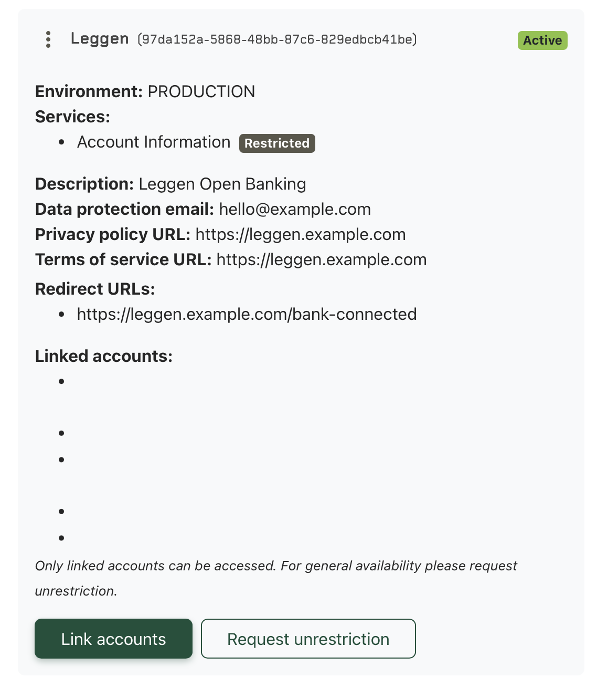

## Connecting a Bank Account

Connecting a bank account is a two-step process. You must first activate the account through Enable Banking's Customer Portal before connecting it through Leggen.

### Step 1: Activate the account in Enable Banking Customer Portal

Before Leggen can access a bank account, Enable Banking requires you to accept their terms and conditions for that specific account. This is done through their Customer Portal:

1. Go to [https://enablebanking.com/cp/applications](https://enablebanking.com/cp/applications)
2. Select your application
3. Click the **"Link accounts"** button

4. Follow the bank authorization flow to link your account
5. Accept Enable Banking's terms and conditions

> **Important:** The bank connection created through the Customer Portal expires after **1 day**. This is expected — the portal connection is only needed to activate the account with Enable Banking. You do not need to repeat this step unless you are connecting a new bank account for the first time.

### Step 2: Connect the account through Leggen

After activating the account in the Customer Portal, connect the same bank account through Leggen's web interface:

1. Open the Leggen web interface
2. Go to **Settings** and click **Add Bank Account**
3. Select your country and bank
4. Complete the bank authorization flow
5. Your account is now connected and will sync automatically

This connection is the one Leggen uses for ongoing access to your transactions and balances.

## Summary

| Step | Where | Purpose | Expires |
|------|-------|---------|---------|
| 1. Link accounts | Enable Banking Customer Portal | Accept T&C, activate account | 1 day |
| 2. Add bank account | Leggen web interface | Ongoing bank data access | ~90 days (varies by bank) |
